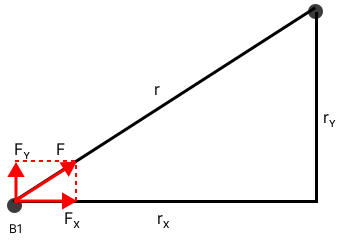

# Lab 6 N-Body Simulation

> "The universe is a dark forest. Every civilization is an armed hunter stalking through the trees like a ghost, gently pushing aside branches that block the path and trying to tread without sound. Even breathing is done with care. The hunter has to be careful, because everywhere in the forest are stealthy hunters like him. If he finds other life—another hunter, an angel or a demon, a delicate infant or a tottering old man, a fairy or a demigod—there’s only one thing he can do: open fire and eliminate them. In this forest, hell is other people. An eternal threat that any life that exposes its own existence will be swiftly wiped out. This is the picture of cosmic civilization. It’s the explanation for the Fermi Paradox." - Liu Cixin, The Three-Body Problem


In this lab, we are going to play with something fun, the n-body simulation. Yes, with you current Python skill, you can already perform these simulation. The Python skill we are practicing include tuples and lists. Of course, we will include skills related to functions and loops.  

## N-Body Problem Introduction

The N-Body simulation attempts to predict the motion of a group of celestial objects that interact with each other through gravitational forces. The fundamental principle behind these interactions is Newton's law of universal gravitation.

In this lab, we will focus on the 2D case, where the bodies are confined to a plane. The simulation will model the motion of the bodies in a discrete time frame, where the positions and velocities of the bodies are updated in small time steps.

### Gravitational Force Calculation:
The gravitational force between two bodies is given by the formula:
$F = G \cdot \dfrac{m_1 \cdot m_2}{r^2}$
where:
- $F$ is the force of gravity,
- $G$ is the gravitational constant ($6.67430 \times 10^{-11} \, \text{m}^3 \text{kg}^{-1} \text{s}^{-2}$),
- $m_1$ and $m_2$ are the masses of the two bodies,
- $r$ is the distance between the centers of the two bodies.

The direction of the force is along the line joining the centers of the two bodies.

### Velocity Calculation:
Velocity of each body is updated based on the gravitational forces acting upon it. The process is broken down into two steps, utilizing Newton's Second Law of motion ($F = ma$):

1. **Acceleration Calculation**:
   According to Newton's Second Law, the acceleration of a body is calculated as:
   $a = \dfrac{F}{m}$
   where:
   - $F$ is the net gravitational force acting on the body,
   - $m$ is the mass of the body.

2. **Velocity Update**:
   The new velocity of the body is then calculated by adding the product of acceleration and a small time step $\Delta t$ to the old velocity:
   $v_{\text{new}} = v_{\text{old}} + a \cdot \Delta t$
   where:
   - $v_{\text{new}}$ and $v_{\text{old}}$ are the new and old velocities of the body,
   - $a$ is the acceleration,
   - $\Delta t$ is a small time step.

This two-step process ensures a more precise update of the velocity, taking into account the change in acceleration due to gravitational forces.

### Discrete Simulation:
Discrete simulation works by approximating the continuous motion of celestial bodies using small time steps. In each time step, the simulation computes the gravitational forces, updates the velocities, and calculates the new positions of all bodies. This approach simplifies the problem and allows for numerical solutions, making it feasible to simulate complex n-body systems.

By breaking down the continuous motion into discrete steps, and updating the positions and velocities of the celestial bodies iteratively, students can understand and observe the dynamics of gravitational interactions in a simplified yet insightful manner. This method also provides a practical way to apply and reinforce Python skills (e.g., tuples, lists, functions, loops) in a context of a real-world physics problem.

## Convert the Physics to Python

Let's consider what data we need to represent the global status of the system. For each body, we need to know its mass, position, and velocity. Consider that we use a 2D space, positions and velocity are not scalars, but vectors. We can use tuples to represent the position and velocity. 

```python
body = (mass, (x, y), (vx, vy))
```

We can use a list to represent the system. 

```python
system = [body1, body2, body3, ...]
```


## TA Instructions 

* Review the physics behind n-body simulation.
* Review Lists and Tuples
* Math functions (e.g., sqrt)
* Doc strings
* Global variables (e.g., G)
* `if __name__ == "__main__":`

## Problems

### Problem 1 (15pt) Calculate the distance between two bodies.

Write a function `calculate_distance(body1, body2)` that takes two bodies as arguments and returns the distance between them. 

### Problem 2 (15pt) Calculate the gravitational force between two bodies.

Write a function `calculate_force(body1, body2)` that takes two bodies as arguments and returns the gravitational force between them. Note that gravitational force is a vector. You need to return a 2-element tuple. 

### Problem 3 (15pt) Calculate the force on a body. 

Write a function `calculate_net_force_on(body, system)` that takes a body and a system as arguments and returns the net gravitational force acting on the body. Here, the system is the list of bodies. Do not forget to exclude the body itself from the system. Otherwise, you will get a division by zero error.

### Problem 4 (15pt) Calculate the acceleration of a body.
Write a function `calculate_acceleration(body, system)` that takes a body and a system as arguments and returns the acceleration of the body.

### Problem 5 (15pt) Update the velocity of all the bodies in the system.
Write a function `update_velocity(system, dt)` that takes a system and a time step as arguments and updates the velocities of all the bodies in the system. The function should return the new states of the system. 

### Problem 6 (15pt) Update the position of all the bodies in the system.
Write a function `update(system, dt)` that takes a system and a time step as arguments and updates the positions of all the bodies in the system. The function should return the new states of the system. In this function, make sure you call the `update_velocity` function first, so that you can use the new velocity to update the position.

### Problem 7 (10pt) Simulate the system for a given time period.
Write a function `simulate(system, dt, num_steps)` that takes a system, a time step, and a number of steps as arguments and simulates the system for the given number of steps, with the given time step between consecutive steps. The function should return the final state of the system.

### Problem 8 (Bonus 10pt) Render the simulation with PyGame.

Write a function `simulate_with_visualization(system, dt, num_steps)`. The function is basically the same with simulate. The only difference is that you need to render the system. There are already two functions provided in the `render.py` file, including `InitRender` and `Render`. You can directly use them. At the beginning of the function, call `InitRender` to show the window. Then, after each step, call `Render` to update the celestial bodies rendered in the window.

There is no test for this problem. You can run it, record a 1min video, upload to YouTube. Then, you can add the link to the end of this README.md file. The TAs will manually check your video. You can only get the point if you get all previous problems pass the test. 

## Hint

If you need to decompose the force on the x- and y-axis, you can check the figure below.



The $F$ to $F_x$ and $F_y$ ratios are the same as the $r$ to $r_x$ and $r_y$ ratios. So you can calculate $F_x$ and $F_y$ using the following formulas.

$F_x = F \cdot \dfrac{r_x}{r}$

$F_y = F \cdot \dfrac{r_y}{r}$


